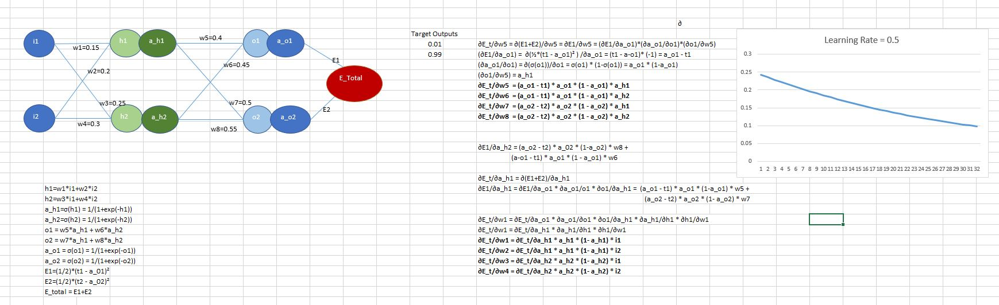

# Backpropagation In Neural Networks

### Neural Network Architecture and Fomula for Backpropagation

### Neural Network Backpropagation weights update and training

### Steps for training NN using Backpropagation. Forward propagation added for completeness
1. Initialize the weights for all edges.
2. Feed forward the NN using inputs,edge weights along with activation functions and predict the output.
3. Finalize on a learning rate.
4. Calculate the prediction error.
5. Take gradient of the error with respect to weight edges.
6. Gradient can be calculated using partial derivative and Gradient flow technique using Calculus chain rule.
7. Update the weights by subtracting corresponding gradients with respect to total error and multiply by the factor of learning rate.
8. Once all the weight are updated calculate new predictions and corresponding error.
9. repeat steps 4-8 till the error value converges.
